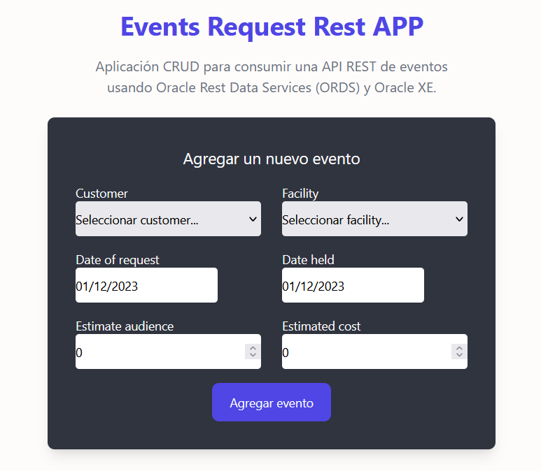
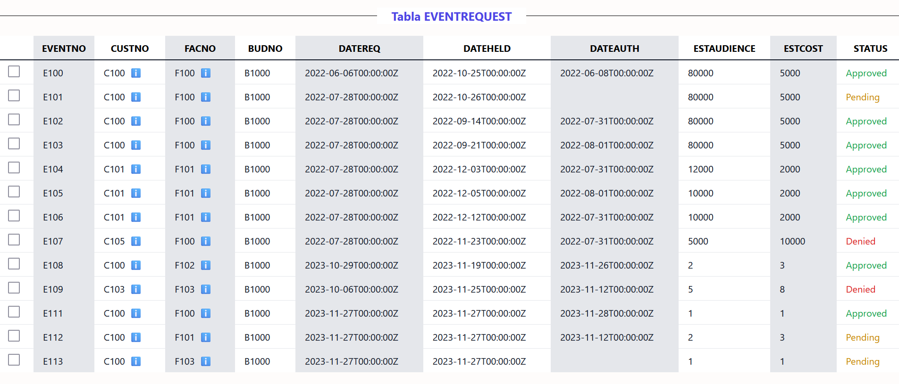
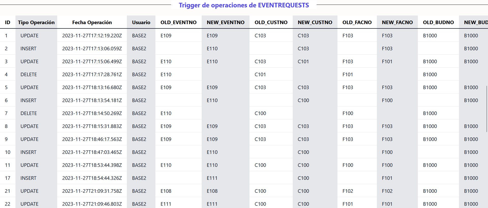

# Oracle Rest App

Este proyecto es una aplicación de React que permite realizar operaciones CRUD a partir de una API montada en ORDS (Oracle REST Data Services). La API toma datos de una base de datos que contiene información sobre solicitudes de eventos.

## Descripción

-   La aplicación permite crear, leer, actualizar y eliminar solicitudes de eventos.
-   La API ORDS proporciona los datos de las solicitudes eventos almacenados en una base de datos de Oracle XE.
-   La aplicación utiliza React Query para realizar las consultas y mutaciones a la API.
-   El estado global de la aplicación se gestiona con useReducer y useContext.
-   El diseño de la aplicación se realiza con Tailwind CSS.
-   React Hot Toast se utiliza para mostrar notificaciones al usuario.

## Instalación

1. Clonar (`git clone git@github.com:Mateoap00/oracle-rest-app.git`) o descargar el .zip del proyecto.
2. Instalar Oracle Xe para la base de datos y abrir SQL-Developer o un gestor de base de datos similar.
3. Conectado como sysdba, crear un nuevo usuario y activar los servicios ORDS para ese usuario, seguir los scripts [01](./src/utils/database/01-create-user.sql) y [02](./src/utils/database/02-habilitar-ords.sql) de la carpeta database.
4. Activar los permisos necesarios para el nuevo usuario creado, seguir script [03](./src/utils/database/03-permisos.sql) de la carpeta database.
5. Crear las tablas necesarias e insertar los datos de la base de datos, seguir script [04](./src/utils/database/04-create-insert-tables-trigger-views.sql) de la carpeta database.
6. Crear los procedimientos para insertar, actualizar y borrar una solicitud de evento en la base de datos, seguir scripts [05](./src/utils/database/05-procedimiento-create.sql), [06](./src/utils/database/06-procedimiento-update.sql) y [07](./src/utils/database/07-procedimiento-delete.sql) de la carpeta database.
7. Activar los patterns de ORDS y definir handlers para los tipos de request a la API, seguir scripts [08](./src/utils/database/08-ords-eventrequest.sql), [09](./src/utils/database/09-ords-customer.sql), [10](./src/utils/database/10-ords-facility.sql) y [11](./src/utils/database/11-ords-audtEventReq.sql).
8. Instalar la aplicación con `npm install`.
9. Ejecutar la aplicacion con `npm run dev` o `npm start`.

## Componentes

Los componentes principales de la aplicación son:

-   **EventsForm:** Un formulario para crear, actualizar y eliminar solicitudes de eventos. Toma una lista de clientes e instalaciones como props. 
-   **EventsTable:** Una tabla que muestra una lista de solicitudes de eventos. Toma una lista de solicitudes de eventos como props. 
-   **AudtsEventsReqTable:** Una tabla que muestra una lista de auditoria para los tipos de operaciones que se realizan en la base de datos. Toma una lista con la información de cada operación como props. 
